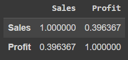

# Ex-07-Data-Visualization-

## AIM
To Perform Data Visualization on the given dataset and save the data to a file. 

# Explanation
Data visualization is the graphical representation of information and data. By using visual elements like charts, graphs, and maps, data visualization tools provide an accessible way to see and understand trends, outliers, and patterns in data.

# ALGORITHM
### STEP 1
Read the given Data
### STEP 2
Clean the Data Set using Data Cleaning Process
### STEP 3
Apply Feature generation and selection techniques to all the features of the data set
### STEP 4
Apply data visualization techniques to identify the patterns of the data.

# CODE
```
Name: Vishal Gowthaman K.R
Reg. no: 212221230123
```
## Data Pre-Processing
```py
import pandas as pd
import numpy as np
import matplotlib.pyplot as plt
import seaborn as sns
```
```py
df = pd.read_csv("/content/drive/MyDrive/Colab Notebooks/Semester 3/19AI403 _Intro to DS/Exp_7/Superstore.csv",encoding="latin-1")
df
```
```py
df.head()
```
```py
df.info()
```
```py
df.drop('Row ID',axis=1,inplace=True)
df.drop('Order ID',axis=1,inplace=True)
df.drop('Customer ID',axis=1,inplace=True)
df.drop('Customer Name',axis=1,inplace=True)
df.drop('Country',axis=1,inplace=True)
df.drop('Postal Code',axis=1,inplace=True)
df.drop('Product ID',axis=1,inplace=True)
df.drop('Product Name',axis=1,inplace=True)
df.drop('Order Date',axis=1,inplace=True)
df.drop('Ship Date',axis=1,inplace=True)
print("Updated dataset")
df
```
```py
df.isnull().sum()
```
```py
#detecting and removing outliers in current numeric data
plt.figure(figsize=(8,8))
plt.title("Data with outliers")
df.boxplot()
plt.show()
```
```py
plt.figure(figsize=(8,8))
cols = ['Sales','Quantity','Discount','Profit']
Q1 = df[cols].quantile(0.25)
Q3 = df[cols].quantile(0.75)
IQR = Q3 - Q1
df = df[~((df[cols] < (Q1 - 1.5 * IQR)) |(df[cols] > (Q3 + 1.5 * IQR))).any(axis=1)]
plt.title("Dataset after removing outliers")
df.boxplot()
plt.show()
```

## Which Segment has Highest sales?
```py
sns.lineplot(x="Segment",y="Sales",data=df,marker='o')
plt.title("Segment vs Sales")
plt.xticks(rotation = 90)
plt.show()
```
```py
sns.barplot(x="Segment",y="Sales",data=df)
plt.xticks(rotation = 90)
plt.show()
```
## Which City has Highest profit?
```py
df.shape
df1 = df[(df.Profit >= 60)]
df1.shape
```
```py
plt.figure(figsize=(30,8))
states=df1.loc[:,["City","Profit"]]
states=states.groupby(by=["City"]).sum().sort_values(by="Profit")
sns.barplot(x=states.index,y="Profit",data=states)
plt.xticks(rotation = 90)
plt.xlabel=("City")
plt.ylabel=("Profit")
plt.show()
```

## Which ship mode is profitable?
```py
sns.barplot(x="Ship Mode",y="Profit",data=df)
plt.show()
```
```py
sns.lineplot(x="Ship Mode",y="Profit",data=df)
plt.show()
```
```py
sns.violinplot(x="Profit",y="Ship Mode",data=df)
```
```py
sns.pointplot(x=df["Profit"],y=df["Ship Mode"])
```
## Sales of the product based on region.
```py
states=df.loc[:,["Region","Sales"]]
states=states.groupby(by=["Region"]).sum().sort_values(by="Sales")
sns.barplot(x=states.index,y="Sales",data=states)
plt.xticks(rotation = 90)
plt.xlabel=("Region")
plt.ylabel=("Sales")
plt.show()
```
```py
df.groupby(['Region']).sum().plot(kind='pie', y='Sales',figsize=(6,9),pctdistance=1.7,labeldistance=1.2)
```
## Find the relation between sales and profit.
```py
df["Sales"].corr(df["Profit"])
```
```py
df_corr = df.copy()
df_corr = df_corr[["Sales","Profit"]]
df_corr.corr()
```
```py
sns.pairplot(df_corr, kind="scatter")
plt.show()
```
## Heatmap
```py
df4=df.copy()

#encoding
from sklearn.preprocessing import LabelEncoder,OrdinalEncoder,OneHotEncoder
le=LabelEncoder()
ohe=OneHotEncoder
oe=OrdinalEncoder()

df4["Ship Mode"]=oe.fit_transform(df[["Ship Mode"]])
df4["Segment"]=oe.fit_transform(df[["Segment"]])
df4["City"]=le.fit_transform(df[["City"]])
df4["State"]=le.fit_transform(df[["State"]])
df4['Region'] = oe.fit_transform(df[['Region']])
df4["Category"]=oe.fit_transform(df[["Category"]])
df4["Sub-Category"]=le.fit_transform(df[["Sub-Category"]])

#scaling
from sklearn.preprocessing import RobustScaler
sc=RobustScaler()
df5=pd.DataFrame(sc.fit_transform(df4),columns=['Ship Mode', 'Segment', 'City', 'State','Region',
                                               'Category','Sub-Category','Sales','Quantity','Discount','Profit'])

#Heatmap
plt.subplots(figsize=(12,7))
sns.heatmap(df5.corr(),cmap="PuBu",annot=True)
plt.show()
```
## Find the relation between sales and profit based on the following category.

### Segment
```py
df_corr = df5.copy()
df_corr = df_corr[["Sales","Profit","Segment"]]
df_corr.corr()
```
### City
```py
df_corr = df5.copy()
df_corr = df_corr[["Sales","Profit","City"]]
df_corr.corr()
```
### States
```py
df_corr = df5.copy()
df_corr = df_corr[["Sales","Profit","State"]]
df_corr.corr()
```
### Segment and Ship Mode
```py
df_corr = df5.copy()
df_corr = df_corr[["Sales","Profit","Segment","Ship Mode"]]
df_corr.corr()
```
### Segment, Ship mode and Region
```py
df_corr = df5.copy()
df_corr = df_corr[["Sales","Profit","Segment","Ship Mode","Region"]]
df_corr.corr()
```

# OUPUT
## Data Pre-Processing
</br>
</br>
</br>
</br>
</br>
</br>
</br>

## Which Segment has Highest sales?


## Which City has Highest profit?


## Which ship mode is profitable?


## Sales of the product based on region.


## Find the relation between sales and profit
</br>
</br>

## Heatmap

## Find the relation between sales and profit based on the following category.

### Segment

### City

### States

### Segment and Ship Mode

### Segment, Ship mode and Region


# Result:
Thus, Data Visualization is performed on the given dataset and save the data to a file.
## Inferences
## Which Segment has Highest sales?
**Consumer Segment has the highest sales**
## Which City has Highest profit?
**New York City has the Highest Profit**
## Which ship mode is profitable?
**First Class Ship Mode is most profitable**
## Sales of the product based on region.
**West region has the most sales**
## Find the relation between sales and profit
**Sales is not much related to profit**
## Find the relation between sales and profit based on the following category.
### Segment
**Profit is much related to Segment than Sales**
### City
**Profit is much related to City than Sales**
### States
**Sales is much related to City than Profit**
### Segment and Ship Mode
**Ship mode is more related to Sales than Profit**
### Segment, Ship mode and Region
**Region is more related to Profit than Sales**
